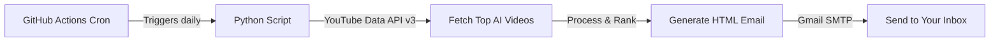

# 🎬 YouTube AI Daily Digest — Implementation Plan

## Overview

Build a Python-based automation agent that:
1. **Searches YouTube** for the top trending videos on AI topics
2. **Curates & ranks** the results by relevance and engagement
3. **Sends a beautifully formatted HTML email** via Gmail every day
4. **Runs 24/7 for free** using GitHub Actions cron workflows

---

## Architecture



## Tech Stack

| Component | Technology | Cost |
|-----------|-----------|------|
| Language | Python 3.12 | Free |
| YouTube Search | YouTube Data API v3 | Free (10,000 units/day) |
| Email Sending | Gmail SMTP + App Password | Free |
| Scheduling | GitHub Actions Cron | Free (2,000 min/month) |
| AI Summarization | Google Gemini API (optional) | Free tier |

## File Structure

```
youtube-automation/
├── .github/
│   └── workflows/
│       └── daily_digest.yml      # GitHub Actions cron workflow
├── src/
│   ├── __init__.py
│   ├── youtube_client.py         # YouTube API integration
│   ├── email_builder.py          # HTML email template builder
│   ├── email_sender.py           # Gmail SMTP sender
│   └── config.py                 # Configuration & constants
├── main.py                       # Entry point
├── requirements.txt              # Python dependencies
├── .env.example                  # Example environment variables
├── .gitignore
├── LICENSE
└── README.md
```

## Search Topics

The agent will search for videos across these AI-related queries:
- `AI latest news`
- `Generative AI`
- `Agentic AI`
- `AI agents tutorial`
- `AI automation tools`
- `Large Language Models`
- `AI coding assistants`

## Required Secrets (GitHub Repository Secrets)

| Secret Name | Description |
|------------|-------------|
| `YOUTUBE_API_KEY` | YouTube Data API v3 key from Google Cloud Console |
| `GMAIL_ADDRESS` | Your Gmail address (sender & recipient) |
| `GMAIL_APP_PASSWORD` | Gmail App Password (NOT your regular password) |
| `RECIPIENT_EMAIL` | Email address to receive the digest (can be same as GMAIL_ADDRESS) |

## Setup Steps

### 1. YouTube Data API Key
- Go to [Google Cloud Console](https://console.cloud.google.com/)
- Create a new project → Enable **YouTube Data API v3**
- Create an API Key under Credentials

### 2. Gmail App Password
- Go to [Google Account Security](https://myaccount.google.com/security)
- Enable 2-Step Verification
- Generate an **App Password** for "Mail"

### 3. GitHub Secrets
- Go to your repo → Settings → Secrets and variables → Actions
- Add all 4 secrets listed above

### 4. Schedule
- Default: Every day at **8:00 AM IST** (2:30 AM UTC)
- Configurable via cron expression in the workflow file

---

## Key Decisions

> [!IMPORTANT]
> **Please confirm the following before I proceed:**
> 1. **Email time**: Is 8:00 AM IST good, or do you prefer a different time?
> 2. **Number of videos**: How many top videos per email? (I'll default to **10**)
> 3. **AI Summary**: Would you like an AI-generated summary of each video using Gemini API (free tier), or just the video title/description/stats?
> 4. **Recipient**: Should the email go to the same Gmail account that sends it, or a different address?
